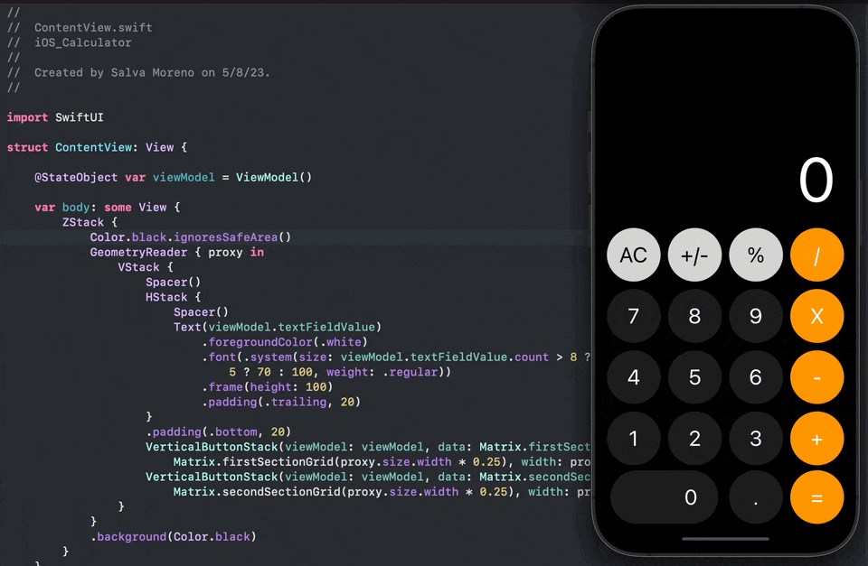

<h1 align="center">
  <strong>Calculadora estilo iOS </strong>
</h1>

---

  <strong>Proyecto personal</strong>

---

  <strong>Autor:</strong> Salva Moreno Sánchez

  

## Índice

* [Herramientas](#herramientas)
* [Proyecto: calculadora iOS](#proyecto)
	* [Aprendizaje](#aprendizaje)
	* [Mejoras propias realizadas respecto al tutorial](#mejoras)

## Herramientas

  
  
  

## Proyecto: calculadora iOS

### Aprendizaje

La creación de este proyecto nace del tutorial *[Cómo crear la APP calculadora de iOS en SWIFTUI y XCODE, Tutorial SwiftUI en Español](https://www.youtube.com/watch?v=oTyRk56WyAI)* del canal de YouTube [SwiftBeta](https://www.youtube.com/@SwiftBeta), en el que he apreciado prácticas, características y casos de uso como:

* **Construcción de un modelo de datos** acorde a las necesidades funcionales y de diseño de los botones de la calculadora, que aplica el protocolo `Hashable` tanto en su `struct` como en los `enums` empleados.
* **Definición de colores personalizados** almacenados en variables. Acción que también se podría llevar a cabo en una `extension` de la clase `Color`.
* **Inicialización del modelo de datos** con los valores correspondientes a cada botón de la calculadora y creación del `array` de `GridItem` para que luego sea recorrido por un `forEach` (de aquí el uso del protocolo `Hashable` en el modelo de datos).
* **Construcción y diseño de la vista del teclado.**
* **Elaboración de toda la lógica de la aplicación** en la clase `ViewModel`, la cual aplica el protocolo `ObservableObject` para que esta y sus datos puedan ser transferidos a las vistas como `@ObservedObject` y como `@StateObject` al *ContentView*.
* Uso de la arquitectura ***Model-View-ViewModel (MVVM)***.

### Mejoras propias realizadas respecto al tutorial

En el tutorial ya mencionado, las funcionalidades de la calculadora se limitan a la suma y multiplicación de números enteros, y del reseteo de operaciones para comenzar a operar de nuevo. De esta forma, me decidí a seguir añadiendo funcionalidades:

* Adicción de las operaciones de **resta y división**.
* Funcionalidad de la **tecla "+/-"** con la que mutamos el signo del factor.
* Funcionalidad de la **tecla "%"** con la que desplazamos dos posiciones a la izquierda la coma o punto del decimal.
* **Poder realizar operaciones de más de un dígito.** En el tutorial sólo se alcanza a realizar operaciones como 5 + 5 o 15 + 5, pero no se podía hacer operaciones en el que el segundo operador tuviera más de un dígito, como 5 + 12 o 10 + 233.
* **Empleo de números decimales.**
* **Adaptación del tamaño de letra** según la longitud de los números.
* **Limitación de la longitud de un factor** a 11 dígitos, si no es decimal, y 10 dígitos, si es decimal; mostrados en pantalla.

---

[Subir ⬆️](#top)